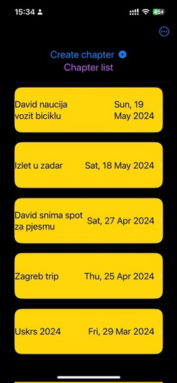
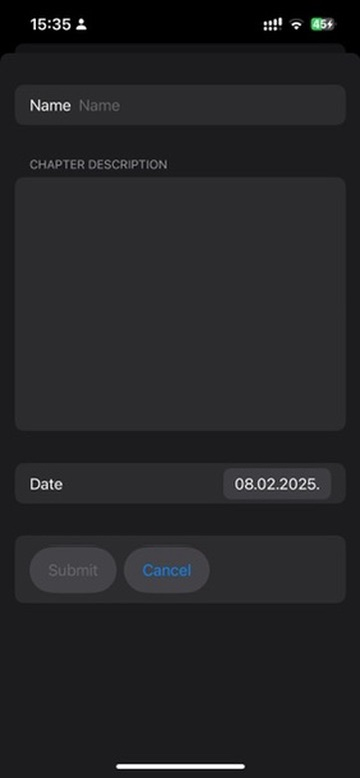
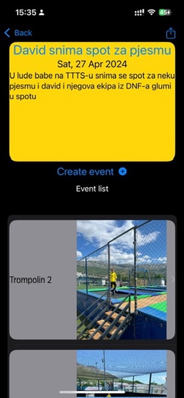
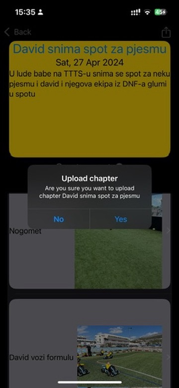
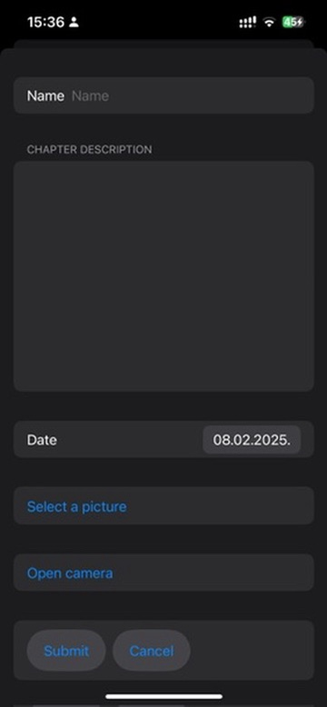
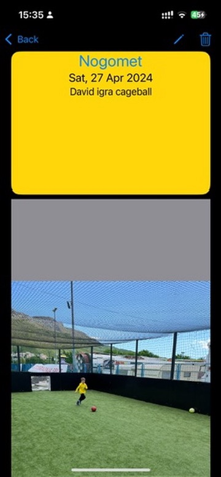

# eDiary
## _iOS application that aows user to create photo albums_

eDiary is iOS application that allows user to create photo albums. They are created as series of chapters and events. Each chapter is basically a photo album that has multiple events. Each event consists of an image and of a description, but image is optional, so it can also be used as a diary. Each chapter can be uploaded to server which is created in .NET. Application also allows to simplz upload images from photo gallery without even creating chapters or events.

## Features

- create, edit and delete chapters
- create,edit and delete events
- upload entire chapter with all of it's events to the server
- upload images to the server without creating chapters and events

## Main screen
- display list of all of the chapters already created
- button that allows user to create neew chapter
- toolbar menu that allows user to upload images to server without even creating chapters or events

### Main screen (create chapter)
- sheet that displays a form to create new chapter
- it is accessed by pressing "Create chapter on main screen"
- each chapter has name, description and date
- once chapter is created it is displayed in a list on  a main screen
- pressing a chapter in a list on a screen user is taken to chapter details screen
- delete chapter by swiping chapter left in a list

### Chapter details screen
- display chapter details
- display list of chapter events
- scroll through events
- edit chapter by pressing yellow tile with chapter details
- upload chapter to server by pressing "share" button in toolbar
- create new event in chapter
- pressing any of the events on the list takes you to the event details screen
- delete event by swiping event left in a list

### Chapter details screen (create event)
- sheet that displays form to create new event
- each event has name, desscription, date and an image
- image can be selected from gallery or you can open camera directly and take a photo

### Event details screen
- display event details and event image
- edit event by pressing pencil button in toolbar
- delete event by pressing trash can button in toolbar
- see image in full size by pressing an image

### Full size image screen
- display image in full size
- pinch to zoom in and out

### Upload from gallery screen
- upload images to server directly from gallery
- screen is accessed through menu in toolbar on Main Screen
- tap select picture to open gallery and select images (you can select multiple or just one)

